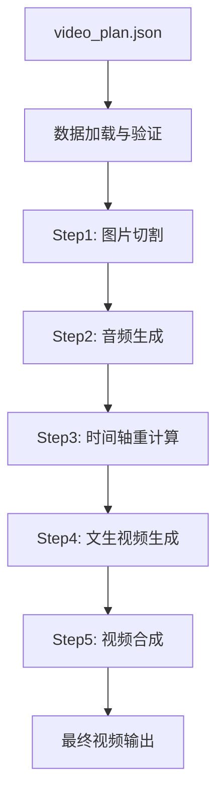
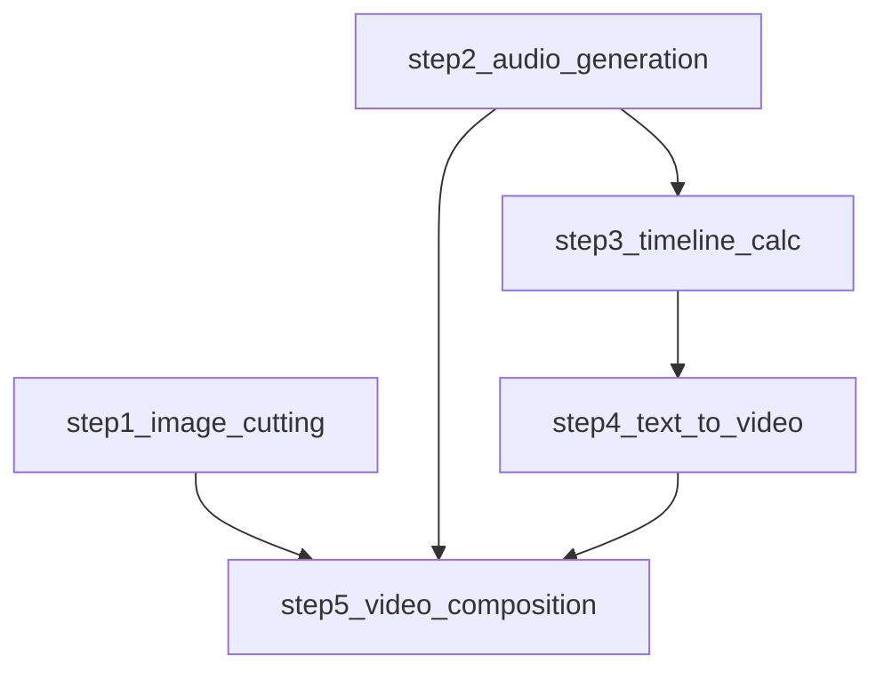

# 📁 VideoMaker 系统设计文档

## 概述

VideoMaker 采用基于 `processing_workflow` 的分层架构设计，实现从输入图片到最终视频的完整数据转换链路。系统确保代码结构与数据处理流程完全对应，提供高可维护性和可扩展性。

## 🏗️ 总体架构

### 分层架构设计

```
VideoMaker/
├── main.py                     # 主程序入口
├── config.py                   # Python配置管理
├── config.yaml                 # YAML配置文件
├── models/                     # 数据模型层
│   ├── __init__.py
│   ├── video_plan.py          # VideoPlan核心数据模型
│   ├── cutting_plan.py        # 切图规划模型
│   ├── narration_script.py    # 旁白脚本模型
│   ├── video_composition.py   # 视频合成模型
│   └── constants.py           # 常量定义
├── steps/                      # 处理步骤层
│   ├── __init__.py
│   ├── step1_image_cutting.py     # 步骤1：图片切割
│   ├── step2_audio_generation.py  # 步骤2：音频生成
│   ├── step3_timeline_calc.py     # 步骤3：时间轴重计算
│   ├── step4_text_to_video.py     # 步骤4：文生视频生成
│   ├── step5_video_composition.py # 步骤5：视频合成
│   └── workflow_executor.py       # 工作流执行器
├── apis/                       # API客户端层
│   ├── __init__.py
│   ├── claude_api.py          # Claude图片分析API
│   ├── video_api.py           # 文生视频API
│   └── tts_api.py             # TTS音频API
├── utils/                      # 工具层
│   ├── __init__.py
│   ├── logger.py              # 日志管理
│   ├── file_utils.py          # 文件操作工具
│   ├── config_manager.py      # 配置管理器
│   ├── image_uploader.py      # 图片上传工具
│   ├── exceptions.py          # 自定义异常
│   └── validators.py          # 数据验证
├── assets/                     # 资产文件层
│   ├── input/                 # 输入资源
│   │   ├── images/            # 源图片文件
│   │   ├── audio/             # 源音频文件
│   │   └── videos/            # 源视频文件
│   ├── examples/              # 示例文件
│   │   ├── video_plan_example.json  # 标准视频规划示例
│   │   ├── simple_plan.json   # 简化版规划示例
│   │   └── demo_script.txt    # 演示脚本
│   └── templates/             # 模板文件
│       ├── plan_template.json # 视频规划模板
│       └── script_template.txt # 脚本模板
├── data/                       # 数据存储层
│   ├── cache/                 # 缓存数据
│   │   ├── api_responses/     # API响应缓存
│   │   ├── processed_images/  # 处理后的图片缓存
│   │   └── temp_files/        # 临时文件缓存
│   ├── models/                # 模型文件
│   │   ├── weights/           # 模型权重文件
│   │   └── configs/           # 模型配置文件
│   └── datasets/              # 数据集
│       ├── training/          # 训练数据
│       └── validation/        # 验证数据
├── tests/                      # 测试层
│   ├── __init__.py
│   ├── test_models.py         # 数据模型测试
│   ├── test_steps.py          # 处理步骤测试
│   ├── test_workflow.py       # 完整工作流测试
│   └── fixtures/              # 测试固件
│       ├── sample_plans/      # 测试用视频规划
│       ├── mock_responses/    # Mock API响应
│       └── test_assets/       # 测试资源文件
└── docs/                       # 文档
    ├── system_design.md        # 系统设计文档（本文档）
    ├── api_reference.md        # API参考文档
    └── user_guide.md           # 用户指南
```

### 分层设计原则

#### 1. 数据模型层 (`models/`)
- **职责**: 定义数据结构，对应 `video_plan_example.json` 的各个部分
- **原则**: 
  - 使用 dataclass 确保类型安全
  - 每个模型文件对应 JSON 的一个主要部分
  - 提供序列化/反序列化方法

#### 2. 处理步骤层 (`steps/`)
- **职责**: 实现具体的处理逻辑，对应 `processing_workflow` 的5个步骤
- **原则**:
  - 每个步骤独立实现，单一职责
  - 统一的接口规范
  - 支持依赖关系管理

#### 3. API客户端层 (`apis/`)
- **职责**: 封装外部API调用
- **原则**:
  - 统一的错误处理
  - 支持重试和超时
  - 接口抽象化

#### 4. 工具层 (`utils/`)
- **职责**: 提供通用工具函数
- **原则**:
  - 无状态函数
  - 高度复用
  - 独立测试

#### 5. 资产文件层 (`assets/`)
- **职责**: 管理项目的输入资源、示例文件和模板
- **原则**:
  - 按类型分类存储（输入资源、示例、模板）
  - 提供标准化的示例和模板
  - 支持多种格式的输入文件

#### 6. 数据存储层 (`data/`)
- **职责**: 管理缓存数据、模型文件和数据集
- **原则**:
  - 分层存储不同类型的数据
  - 实现高效的缓存机制
  - 支持模型版本管理

## 📊 核心数据模型

### VideoPlan - 核心数据容器

```python
@dataclass
class VideoPlan:
    meta_info: MetaInfo
    cutting_plan: CuttingPlan
    text_to_video_plan: TextToVideoPlan
    narration_script: NarrationScript
    video_composition: VideoComposition
    processing_workflow: ProcessingWorkflow
```

### 数据模型层次结构

```
VideoPlan
├── meta_info: MetaInfo
│   ├── title: str
│   ├── description: str
│   ├── duration: float
│   └── creation_time: str
├── cutting_plan: CuttingPlan
│   ├── source_image: SourceImage
│   └── regions: List[CuttingRegion]
├── text_to_video_plan: TextToVideoPlan
│   └── segments: List[VideoSegment]
├── narration_script: NarrationScript
│   └── segments: List[AudioSegment]
├── video_composition: VideoComposition
│   ├── timeline: Timeline
│   ├── visual_effects: List[VisualEffect]
│   └── background_track: BackgroundTrack
└── processing_workflow: ProcessingWorkflow
    └── steps: List[WorkflowStep]
```

## 🌊 数据流转过程

### 完整数据流程图



### 各步骤详细流程

#### Step 1: 图片切割


**数据变化**:
```python
# 输入状态
cutting_plan.regions[0].coordinates = None  # 待分析

# 输出状态  
cutting_plan.regions[0].coordinates = {
    "x": 100, "y": 50, "width": 400, "height": 200
}
cutting_plan.regions[0].output_path = "slice_1_标题.png"
```

#### Step 2: 音频生成


**数据变化**:
```python
# 输入状态
segments[0].audio_file_path = None
segments[0].duration = None

# 输出状态
segments[0].audio_file_path = "audio_segment_1.wav"
segments[0].duration = 3.5  # 秒
```

#### Step 3: 时间轴重计算
根据实际音频时长重新计算时间轴分配。

#### Step 4: 文生视频生成
基于文本提示生成背景视频。

#### Step 5: 视频合成
整合所有素材，输出最终视频。

## 📋 接口规范

### 处理步骤接口

```python
class BaseStep:
    def execute(self, video_plan: VideoPlan, output_dir: str) -> StepResult:
        """执行处理步骤"""
        pass
    
    def validate_inputs(self, video_plan: VideoPlan) -> bool:
        """验证输入参数"""
        pass
    
    def get_dependencies(self) -> List[str]:
        """获取依赖的步骤列表"""
        pass
```

### 数据模型接口

```python
class BaseModel:
    @classmethod
    def from_dict(cls, data: dict) -> 'BaseModel':
        """从字典创建对象"""
        pass
    
    def to_dict(self) -> dict:
        """转换为字典"""
        pass
    
    def validate(self) -> bool:
        """验证数据有效性"""
        pass
```

## 🔄 依赖关系

### 步骤依赖图



### 模块依赖层次

```
main.py
├── steps/workflow_executor.py
│   ├── steps/step*.py
│   ├── models/video_plan.py
│   └── utils/logger.py
├── apis/claude_api.py
└── config.py
```

## 📂 目录结构详细规划

### Assets 资产文件层

`assets/` 目录负责管理项目的所有输入资源、示例文件和模板文件，按功能和类型进行分类存储。

#### assets/input/ - 输入资源目录

```
assets/input/
├── images/                     # 源图片文件
│   ├── infographics/          # 信息图类图片
│   ├── screenshots/           # 屏幕截图
│   ├── photos/                # 照片素材
│   └── charts/                # 图表文件
├── audio/                      # 源音频文件
│   ├── narration/             # 旁白音频
│   ├── background_music/      # 背景音乐
│   └── sound_effects/         # 音效文件
└── videos/                     # 源视频文件
    ├── backgrounds/           # 背景视频
    ├── overlays/              # 叠加视频
    └── transitions/           # 转场视频
```

**使用规范**:
- 支持常见格式：图片(PNG, JPG, WEBP)，音频(MP3, WAV, AAC)，视频(MP4, MOV, AVI)
- 建议文件命名：`{项目名}_{用途}_{序号}.{扩展名}`
- 单文件大小限制：图片<50MB，音频<100MB，视频<500MB

#### assets/examples/ - 示例文件目录

```
assets/examples/
├── video_plan_example.json     # 标准视频规划示例
├── simple_plan.json           # 简化版规划示例
├── complex_plan.json          # 复杂场景规划示例
├── demo_script.txt            # 演示脚本文件
├── sample_images/             # 示例图片
│   ├── infographic_demo.png   # 演示信息图
│   └── chart_example.jpg      # 图表示例
└── sample_outputs/            # 示例输出
    ├── generated_audio.mp3    # 生成的音频示例
    └── final_video.mp4        # 最终视频示例
```

**功能说明**:
- `video_plan_example.json`: 完整的标准视频规划，展示所有可用字段
- `simple_plan.json`: 最小化配置示例，适合快速开始
- `complex_plan.json`: 复杂场景示例，展示高级功能用法

#### assets/templates/ - 模板文件目录

```
assets/templates/
├── plans/                      # 视频规划模板
│   ├── infographic_template.json      # 信息图视频模板
│   ├── presentation_template.json     # 演示文稿模板
│   ├── tutorial_template.json         # 教程视频模板
│   └── marketing_template.json        # 营销视频模板
├── scripts/                    # 脚本模板
│   ├── narration_template.txt  # 旁白脚本模板
│   ├── intro_template.txt      # 开场白模板
│   └── outro_template.txt      # 结尾模板
└── configs/                    # 配置模板
    ├── quick_config.yaml       # 快速配置模板
    └── production_config.yaml  # 生产环境配置模板
```

### Data 数据存储层

`data/` 目录负责管理系统运行时产生的各种数据，包括缓存、模型文件和数据集。

#### data/cache/ - 缓存数据目录

```
data/cache/
├── api_responses/              # API响应缓存
│   ├── claude/                # Claude API响应缓存
│   │   ├── image_analysis/    # 图片分析结果缓存
│   │   └── text_generation/   # 文本生成结果缓存
│   ├── video_api/             # 视频生成API缓存
│   │   ├── text_to_video/     # 文生视频缓存
│   │   └── image_to_video/    # 图生视频缓存
│   └── tts_api/               # TTS API响应缓存
│       ├── audio_files/       # 生成的音频文件
│       └── synthesis_logs/    # 合成日志
├── processed_images/           # 处理后的图片缓存
│   ├── cut_regions/           # 切割区域缓存
│   ├── resized/               # 尺寸调整后的图片
│   └── optimized/             # 优化后的图片
└── temp_files/                # 临时文件缓存
    ├── uploads/               # 上传临时文件
    ├── downloads/             # 下载临时文件
    └── processing/            # 处理中间文件
```

**缓存策略**:
- API响应缓存：24小时过期，按哈希值存储
- 图片处理缓存：7天过期，支持版本管理
- 临时文件：1小时过期，自动清理

#### data/models/ - 模型文件目录

```
data/models/
├── weights/                    # 模型权重文件
│   ├── image_analysis/        # 图片分析模型
│   ├── text_processing/       # 文本处理模型
│   └── video_generation/      # 视频生成模型
├── configs/                   # 模型配置文件
│   ├── model_configs.json     # 模型参数配置
│   ├── training_configs.yaml  # 训练配置
│   └── inference_configs.yaml # 推理配置
└── metadata/                  # 模型元数据
    ├── model_registry.json    # 模型注册表
    ├── version_history.json   # 版本历史
    └── performance_metrics.json # 性能指标
```

#### data/datasets/ - 数据集目录

```
data/datasets/
├── training/                   # 训练数据
│   ├── image_datasets/        # 图片数据集
│   ├── text_datasets/         # 文本数据集
│   └── video_datasets/        # 视频数据集
├── validation/                # 验证数据
│   ├── test_cases/            # 测试用例
│   ├── benchmarks/            # 基准测试
│   └── ground_truth/          # 标准答案
└── user_data/                 # 用户数据
    ├── projects/              # 用户项目数据
    ├── preferences/           # 用户偏好设置
    └── history/               # 使用历史记录
```

### 目录管理策略

#### 自动化管理

```python
# 目录初始化和清理
def initialize_directories():
    """初始化所有必需的目录结构"""
    directories = [
        "assets/input/images",
        "assets/input/audio", 
        "assets/input/videos",
        "data/cache/api_responses",
        "data/cache/processed_images",
        "data/cache/temp_files"
    ]
    for directory in directories:
        os.makedirs(directory, exist_ok=True)

def cleanup_cache(max_age_hours=24):
    """清理过期的缓存文件"""
    # 实现缓存清理逻辑
    pass
```

#### 存储配额管理

- **Cache总容量**: 最大10GB，超出时自动清理最旧文件
- **Models存储**: 最大5GB，支持按需下载
- **Datasets存储**: 最大20GB，支持外部存储挂载

#### 备份和同步

- **重要数据**: assets/examples/, assets/templates/ 纳入版本控制
- **缓存数据**: data/cache/ 排除在版本控制外，支持云同步
- **用户数据**: data/datasets/user_data/ 支持自动备份

## ⚙️ 配置管理

### 配置层次结构

1. **config.yaml** - 主配置文件，包含所有默认配置
2. **环境变量** - 敏感信息（API密钥）
3. **config.py** - Python配置管理器
4. **命令行参数** - 运行时配置

优先级：命令行 > 环境变量 > config.yaml > 默认值

### 配置文件结构

```yaml
# Claude API配置
claude:
  api_key: "${CLAUDE_API_KEY}"
  base_url: "https://api.anthropic.com"

# 视频生成API配置
video:
  api_key: "${VIDEO_API_KEY}"
  base_url: "https://api.video.com"

# 路径配置
paths:
  # 输入路径
  input_dir: "assets/input"
  default_image_path: "assets/input/images"
  templates_dir: "assets/templates"
  examples_dir: "assets/examples"
  
  # 输出路径
  output_dir: "output"
  temp_dir: "temp"
  logs_dir: "logs"
  
  # 缓存和数据路径
  cache_dir: "data/cache"
  models_dir: "data/models"
  datasets_dir: "data/datasets"

# 处理配置
processing:
  max_cuts: 10
  max_scenes: 5
  video_quality: 95
  
# 缓存配置
cache:
  enable: true
  max_size_gb: 10
  api_cache_hours: 24
  image_cache_days: 7
  temp_file_hours: 1
  
# 存储配置
storage:
  auto_cleanup: true
  backup_user_data: true
  external_storage: false
```

## 🛡️ 数据验证机制

### 输入验证

```python
def validate_video_plan(plan: VideoPlan) -> ValidationResult:
    """验证视频规划数据的完整性和有效性"""
    errors = []
    
    # 检查必填字段
    if not plan.meta_info.title:
        errors.append("标题不能为空")
        
    # 检查文件路径
    if not os.path.exists(plan.cutting_plan.source_image.file_path):
        errors.append("源图片文件不存在")
        
    return ValidationResult(is_valid=len(errors)==0, errors=errors)
```

### 步骤执行状态

```python
@dataclass
class StepResult:
    step_name: str
    status: str  # "pending", "running", "completed", "failed"
    start_time: datetime
    end_time: Optional[datetime]
    output_files: List[str]
    error_message: Optional[str]
    metadata: Dict[str, Any]
```

## 📁 文件组织结构

### 工作目录结构

```
project_root/
├── input/                      # 输入文件
│   └── source_image.jpg
├── output/                     # 最终输出
│   └── final_video.mp4
├── temp/                       # 临时文件
│   ├── step1_cutting/         # 图片切片
│   ├── step2_audio/           # 音频文件
│   ├── step4_video/           # 背景视频
│   └── composition/           # 合成中间文件
└── logs/                      # 执行日志
    └── execution.log
```

### 文件命名规范

- 切片文件: `slice_{region_id}_{region_name}.png`
- 音频文件: `audio_segment_{index}_{duration}s.wav`
- 背景视频: `background_video_{segment_id}.mp4`
- 最终视频: `{project_name}_final_{timestamp}.mp4`

## 🎨 命名规范

### 文件命名
- 步骤文件: `step{n}_{功能描述}.py`
- 模型文件: `{模型名}.py`
- API文件: `{服务名}_api.py`
- 工具文件: `{功能}_utils.py`

### 类命名
- 步骤类: `Step{N}{功能名}`
- 模型类: `{模型名}Model` 或直接 `{模型名}`
- API类: `{服务名}API`
- 工具类: `{功能名}Utils`

### 函数命名
- 处理函数: `execute()`, `process()`, `handle()`
- 转换函数: `to_dict()`, `from_dict()`, `convert()`
- 验证函数: `validate()`, `check()`, `verify()`

## 🚀 扩展指南

### 添加新的处理步骤

1. 在 `steps/` 目录创建 `step{n}_{name}.py`
2. 实现 `BaseStep` 接口
3. 在 `workflow_executor.py` 中注册
4. 添加对应的测试文件
5. 更新配置文件
6. 更新文档

### 添加新的数据模型

1. 在 `models/` 目录创建模型文件
2. 实现 `BaseModel` 接口
3. 添加类型注解和验证
4. 添加单元测试
5. 更新 `video_plan.py` 引用

### 添加新的API客户端

1. 在 `apis/` 目录创建API文件
2. 实现统一的错误处理
3. 添加重试和超时机制
4. 在 `config.yaml` 中添加配置
5. 编写Mock测试

## 📈 性能优化

### 惰性加载
```python
@property
def cutting_regions(self) -> List[CuttingRegion]:
    """惰性加载切割区域数据"""
    if not hasattr(self, '_cutting_regions'):
        self._cutting_regions = self._load_cutting_regions()
    return self._cutting_regions
```

### 数据缓存
```python
@lru_cache(maxsize=128)
def get_audio_duration(file_path: str) -> float:
    """缓存音频时长计算结果"""
    return librosa.get_duration(filename=file_path)
```

### 流式处理
```python
def process_large_image(image_path: str) -> Iterator[np.ndarray]:
    """流式处理大图片"""
    with Image.open(image_path) as img:
        for chunk in image_chunks(img, chunk_size=1024):
            yield np.array(chunk)
```

## 🔧 数据转换工具

### JSON序列化支持

```python
class VideoPlanEncoder(json.JSONEncoder):
    """VideoPlan对象的JSON编码器"""
    def default(self, obj):
        if hasattr(obj, 'to_dict'):
            return obj.to_dict()
        return super().default(obj)
```

### 数据迁移支持

```python
def migrate_video_plan(old_data: dict, target_version: str) -> dict:
    """数据格式迁移，支持向后兼容"""
    if target_version == "v2.0":
        old_data.setdefault("processing_workflow", {})
    return old_data
```

---

这个系统设计确保了代码的可维护性、可扩展性和可测试性，同时与数据处理流程保持一致。通过统一的配置管理和清晰的分层架构，为项目的长期发展奠定了坚实的基础。 